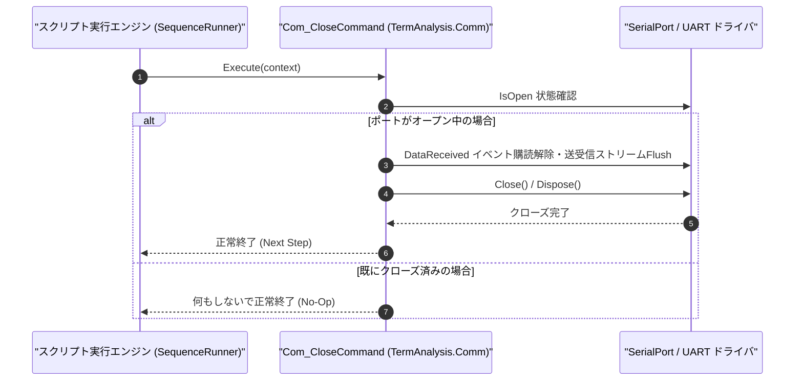

# コマンドリファレンス：Com_Close

## 概要

**Com_Close** は、現在オープンされている COM ポート（UART 回線）の非同期受信監視スレッドを安全に停止し、シリアルポートハンドルを解放・切断するコマンドです。

> 💡 **補足**: シーケンス終了時や通信テスト完了時に確実にポートを解放するために使用します。

---

## 💡 書式・パラメータ仕様

### コマンド構文

```csv
,SEQUENCE, [ステップキー], Com_Close
```

### パラメータ（引数）一覧

| 引数位置 | パラメータ名 | 必須/任意 | 型・制約 | 説明 |
| :--- | :--- | :---: | :--- | :--- |
| （引数なし） | - | - | - | 現在接続中の COM ポートをクローズします。 |

---

## 🔄 特殊置換規約・分岐規約の適用

本コマンドの引数における特殊記法および解釈ルールです。
* **動的置換（`$`）**: 本コマンドは引数を取らないため、引数に対する `$PARAMキー$` 動的置換は適用されません。（適用可能な引数: 非適用）
* **ジャンプ先指定（`#`）**: 本コマンドはジャンプ制御を行わないため適用されません。（適用可能な引数: 非適用）
* **共通コマンド指定（`@`）**: 本コマンドは外部マクロを呼び出さないため、共通コマンド呼び出し記法は適用されません。（適用可能な引数: 非適用）
* **カンマのエスケープ**: 通信条件文字列（例: `"9600,E,7,1"`）や複数データのカンマ区切り値を単一引数として渡す場合は、必ず `"..."` と二重引用符で囲んで記述します。
* **エイリアス（別名）**: `Close`, `Term_Close`, `Analysis_Term_Close`

---

## 💡 動作例（正しい構文での記述例）

### スクリプト記述例

※COMMAND ブロック配下の子要素行（PARAM, SEQUENCE）は必ず行頭カンマから開始し、スペースインデントや行末コメント（`;`）は記述しないでください。

```csv
COMMAND, "SAMPLE_COM_CLOSE", ""
; 1. COMポートを開いてステータスコマンドを送信
,SEQUENCE, 010, Com_Open
,SEQUENCE, 020, Com_Send, "STATUS?"
,SEQUENCE, 030, Com_WaitPrompt, "OK", "3000"
; 2. 受信データをWork変数へ格納した後にCOMポートをクローズ
,SEQUENCE, 040, Set_Data, "@RECV_LINE", "SBuf", "1"
,SEQUENCE, 050, Com_Close
,SEQUENCE, 060, Exit
```

### 実行時の挙動・変数変化

* **実行前の状態**: Term 通信エンジンが初期化され、必要な通信パラメータおよび変数プール（`PARAM`）が準備されている状態。
* **実行後の状態**: `Set_Data` により受信バッファ（`SBuf` / `TermRingBufferManager`）内の応答行が `@RECV_LINE` に取り込まれます。 `Com_Close` の実行によりシリアルポートの受信イベント購読が解除され、OS へ COM ポートハンドルが返却されます。

---

## 🔄 動作フロー（シーケンス図）


```mermaid
sequenceDiagram
    autonumber
    participant Script as "スクリプト実行エンジン (SequenceRunner)"
    participant Cmd as "Com_CloseCommand (TermAnalysis.Comm)"
    participant Port as "SerialPort / UART ドライバ"

    Script->>Cmd: Execute(context)
    Cmd->>Port: IsOpen 状態確認
    alt ポートがオープン中の場合
        Cmd->>Port: DataReceived イベント購読解除・送受信ストリームFlush
        Cmd->>Port: Close() / Dispose()
        Port-->>Cmd: クローズ完了
        Cmd-->>Script: 正常終了 (Next Step)
    else 既にクローズ済みの場合
        Cmd-->>Script: 何もしないで正常終了 (No-Op)
    end
```

---

## 🚫 エラーハンドリング・安全設計（仕様制限）

1. **未接続時の安全な無視（No-Op 保証）**:
   - ポートがオープンされていない状態で `Com_Close` を実行してもエラーにはならず、安全に次のステップへ進みます。
2. **受信バッファ内データの保持**:
   - `Com_Close` を実行しても、すでに `TermRingBufferManager` に格納されている受信済みデータは即座に消去されず、後続の `Set_Data` や `Get_Line` で参照可能です（次回 `Com_Open` 時にクリアされます）。

---

## 🧪 ユニットテスト仕様

本コマンドクラス（`Com_CloseCommand.cs`）に実装されている `RunUnitTest()` メソッドが検証するユニットテストの仕様です。

### テスト実行前提条件

* **実行トリガー**: `RunUnitTest()` メソッドの呼び出し
* **有効化条件**: システム全体の最小ログレベル（`ErrorLogger.MinimumLevel`）が `LogLevel.Test` であること（それ以外の場合は無効化ガードにより早期リターン）
* **検証結果出力**: `_log.LogTest` によるログ出力。検証失敗時は `_log.LogError`、予期せぬ例外発生時は `_log.LogCritical` で記録し、`finally` ブロックで `UartTransportCore.Shared.IsSimulationMode` をテスト開始前の状態へ復元します。

### テストケース一覧

| No | テストカテゴリ | テスト条件（入力値） | 期待される結果（出力値） | 検証の目的 / 観点 |
| :---: | :--- | :--- | :--- | :--- |
| **1** | 正常系 | `IsSimulationMode = true` 環境下で `OpenExclusiveSession(TermTransportDomain.Com, null, useSocket: false)` 実行後、引数なしで `Com_Close` を実行 | `!param.HasError` かつ `!UartTransportCore.Shared.IsOpen`、`ActiveDomain == TermTransportDomain.None` となる | COM 排他セッションの正常切断およびポート解放の検証 |
| **2** | 異常系 | 余剰引数の指定（`ValidateParamRange(0, 0)` 違反）または切断処理中の例外発生 | 引数範囲外エラー出力による早期リターン、または `_log.LogCritical` 記録と `SetErrorAndHalt(-1, ex.Message)` による安全停止 | 引数なし制約の境界検証および例外発生時のクラッシュ防御検証 |
